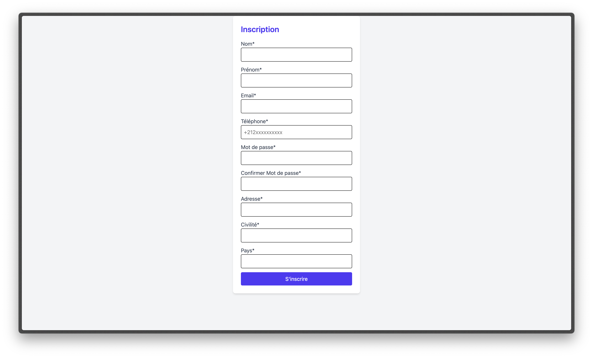
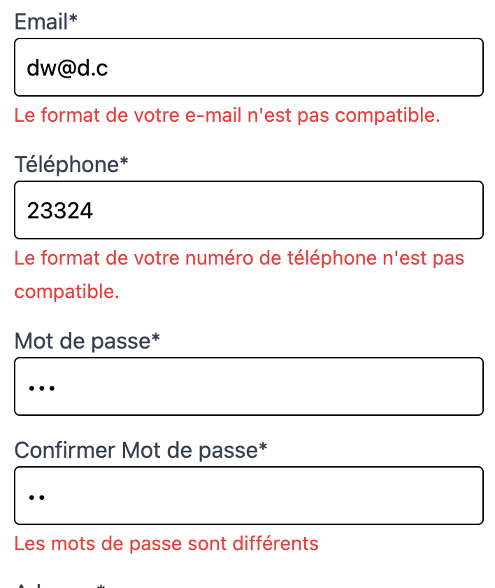
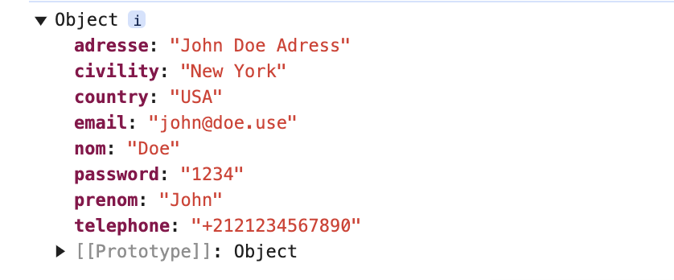

# Form with JS



### Fonctionnalités

**1. Saisie des informations :** L'utilisateur doit remplir les champs obligatoires : Nom, Prénom, Email, Téléphone, Mot de passe, Confirmation de mot de passe, Adresse, Civilité et Pays.

**2. Validation en temps réel :**

  * Vérification des champs vides (message d'erreur "Ce champ est obligatoire!").
    


  * Vérification du format de l'email (ex : exemple@domaine.com).

```javascript
const reg_email = /^[A-Za-z0-9-_.]+@[A-Za-z0-9-_.]+\.[a-zA-Z]{2,}$/;
```
   * Vérification du format du numéro de téléphone (doit commencer par + suivi de l'indicatif et de 10 chiffres).

```javascript
const reg_tel = /^\+[0-9]{1,3}\d{10}$/;
```

  * Vérification de la correspondance des mots de passe.
```javascript
if (password.value != confirmPassword.value) {
            confirmPassword.nextElementSibling.innerText = "Les mots de passe sont différents"
        }
```
**3. Affichage des erreurs : Les erreurs sont affichées sous chaque champ non valide.**


   
**5. Affichage des données dans la console : Si toutes les validations sont réussies, les données sont affichées dans la console.**


